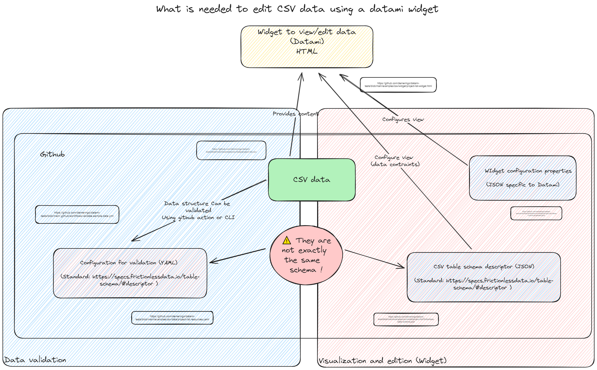

# datami-tests

Testing Datami widget to edit CSV files [https://datami.multi.coop/](https://datami.multi.coop/) with an additional validation in CLI or through github action.


- [datami-tests](#datami-tests)
  - [Purpose](#purpose)
  - [Content](#content)
  - [Validating the CSV file](#validating-the-csv-file)
    - [Define the model used for validation](#define-the-model-used-for-validation)
    - [Validating a data file locally (CLI)](#validating-a-data-file-locally-cli)
      - [Install frictionless package](#install-frictionless-package)
      - [Validate data](#validate-data)
    - [Validate a data file in CI (github action)](#validate-a-data-file-in-ci-github-action)
  - [Datami widget configuration](#datami-widget-configuration)
  - [References](#references)

## Purpose

Demonstrate and document how we can use Datami and other components to:

- ease the edition of a csv file stored in Github 
- constraint the display of fields in the Datami widget
- investigate how we can use github actions to ensure that the csv file structure and or content is valid according to a model.

The approach of Datami component is:

1. to rely on Github to store the CSV file
2. offer a html widget to visualize or edit content of the file for users who may not want to use Github directly
3. automate the push of modifications to the data done via the widget as Github pull requests



> [!WARNING]
> The data validation and the data edition (widget) are configured using different set of files or data models.
> These data model use different syntax but have to be kept in sync manually !

## Content

- Data and data validation:
  - examples/csv/data: data files and related resources files to validate in CI
    - data (csv file):[project-list.csv](https://github.com/demeringo/datami-tests/blob/main/examples/csv/data/project-list.csv)
    - definition (model file) for data validation (CLI or CI) [project-list.resources.yaml](https://github.com/demeringo/datami-tests/blob/main/examples/csv/data/project-list.resources.yaml)
  - .github/workflows: actions to automate validation
    - Example github action that validates data file on pull request [validate-sample-data.yml](https://github.com/demeringo/datami-tests/blob/main/.github/workflows/validate-sample-data.yml)
- Data visualisation and edition (Configuration of Datami widget)
  - examples/csv/model: model for the csv data (be used by the widget)
    - Table schema [project-list.frictionless-table-schema.json](https://github.com/demeringo/datami-tests/blob/main/examples/csv/model/project-list.frictionless-table-schema.json)
  - example/csv/widget: widget and widget configuration examples
    - configuration file for the widget: [project-list.fields-custom-properties.json](https://github.com/demeringo/datami-tests/blob/main/examples/csv/widget/project-list.fields-custom-properties.json)
    - configured widget:[project-list-widget.html](https://github.com/demeringo/datami-tests/blob/main/examples/csv/widget/project-list-widget.html)

## Validating the CSV file

> [!NOTE]
> This validation is unrelated to Datami or the use of the widget.

The Goal here is to be able to validate that the CSV file is consistent with the data model.

We can validate the file in CLI (local mode) or / and as a github action.

The output of the validation is easier (more direct) to read and analyse in local mode. But the github action still provides a report file that can be downloaded if validation fails.

### Define the model used for validation

The model describing the file is [project-list.resources.yaml](https://github.com/demeringo/datami-tests/blob/main/examples/csv/data/project-list.resources.yaml).

> [!WARNING]  
> In the case of multi valued columns, the validation involves describing the allowed values as a REGEXP.

### Validating a data file locally (CLI)

#### Install frictionless package

```sh
pip install "frictionless[excel,json]" --pre
```

#### Validate data

Example with a file that contains invalid / not authorized values.

Line 3 of data contains a value `csharp` which is not in the pattern of authorized values  (see project-list.resources.yaml) where the pattern or allowed values / types are defined.

```csv
Boaviztapi,https://github.com/Boavizta/,ready,csharp
```

```sh
cd examples/csv/data
frictionless validate project-list.resources.yaml

─────────────────────────────────────────────────────── Dataset ────────────────────────────────────────────────────────
                       dataset
┏━━━━━━━━━━━━━━┳━━━━━━━┳━━━━━━━━━━━━━━━━━━┳━━━━━━━━━┓
┃ name         ┃ type  ┃ path             ┃ status  ┃
┡━━━━━━━━━━━━━━╇━━━━━━━╇━━━━━━━━━━━━━━━━━━╇━━━━━━━━━┩
│ project-list │ table │ project-list.csv │ INVALID │
└──────────────┴───────┴──────────────────┴─────────┘
──────────────────────────────────────────────────────── Tables ────────────────────────────────────────────────────────
                                                      project-list
┏━━━━━┳━━━━━━━┳━━━━━━━━━━━━━━━━━━┳━━━━━━━━━━━━━━━━━━━━━━━━━━━━━━━━━━━━━━━━━━━━━━━━━━━━━━━━━━━━━━━━━━━━━━━━━━━━━━━━━━━━━┓
┃ Row ┃ Field ┃ Type             ┃ Message                                                                             ┃
┡━━━━━╇━━━━━━━╇━━━━━━━━━━━━━━━━━━╇━━━━━━━━━━━━━━━━━━━━━━━━━━━━━━━━━━━━━━━━━━━━━━━━━━━━━━━━━━━━━━━━━━━━━━━━━━━━━━━━━━━━━┩
│ 3   │ 4     │ constraint-error │ The cell "csharp" in row at position "3" and field "languages" at position "4" does │
│     │       │                  │ not conform to a constraint: constraint "pattern" is "^(rust|python|docker|other\   │
│     │       │                  │ tek)?(\|(rust|python|docker|other\ tek))*$"                                         │
└─────┴───────┴──────────────────┴─────────────────────────────────────────────────────────────────────────────────────┘

```

After fixing the data file (replace the `csharp` value by `python|docker`).

```csv
Boaviztapi,https://github.com/Boavizta/,ready,python|docker
```

```sh
frictionless validate project-list.resources.yaml
─────────────────────────────────────────────────────── Dataset ────────────────────────────────────────────────────────
                      dataset
┏━━━━━━━━━━━━━━┳━━━━━━━┳━━━━━━━━━━━━━━━━━━┳━━━━━━━━┓
┃ name         ┃ type  ┃ path             ┃ status ┃
┡━━━━━━━━━━━━━━╇━━━━━━━╇━━━━━━━━━━━━━━━━━━╇━━━━━━━━┩
│ project-list │ table │ project-list.csv │ VALID  │
└──────────────┴───────┴──────────────────┴────────┘
```

### Validate a data file in CI (github action)

See sample github action (`.github/workflows/validate-sample-data.yml`)

```yaml
jobs:

  # Validate

  validate:
    runs-on: ubuntu-latest
    steps:
      - name: Checkout repository
        uses: actions/checkout@v2
      - name: Validate data
        uses: frictionlessdata/repository@v2
        with:
          resources: examples/csv/data/project-list.resources.yaml
```

## Datami widget configuration

The widget is mainly configured using 2 distinct files:

- a data model (table schema) [project-list.frictionless-table-schema.json](https://github.com/demeringo/datami-tests/blob/main/examples/csv/model/project-list.frictionless-table-schema.json) 
- a configuration file for the widget: [project-list.fields-custom-properties.json](https://github.com/demeringo/datami-tests/blob/main/examples/csv/widget/project-list.fields-custom-properties.json)

> [!TIP]
> The model itself make no distinction between mono-valued or multi-valued fields, the 2 types of fields are described as enum without cardinality.
> To distinguish mono-valued fields from multi-valued fields in edition, the widget configuration file use respectively the subtype tag (singular) vs tags (with a plural and an optional field separator).

## References

- [https://datami.multi.coop/](https://datami.multi.coop/)
- [Datami parameter doc](https://datami-docs.multi.coop/docs-gitfile?locale=en#keys-for-the-options-parameter-for-csv-and-tsv-files)
- [Table Schema | Data Package (v1)](https://specs.frictionlessdata.io//table-schema/)
- [frictionless-ci | Frictionless Repository](https://repository.frictionlessdata.io/)